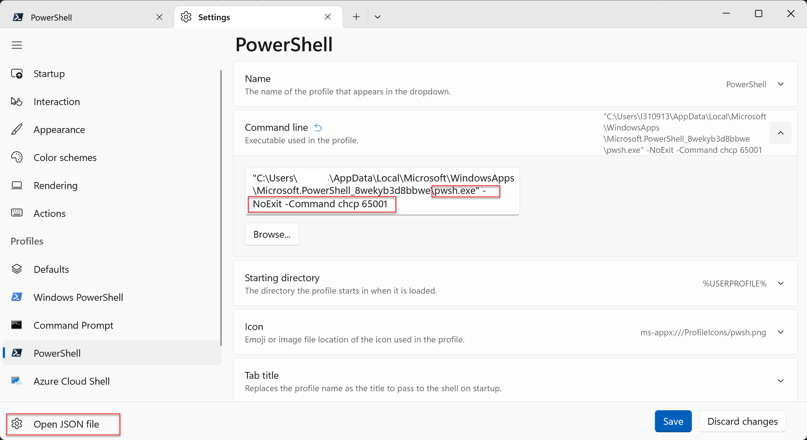
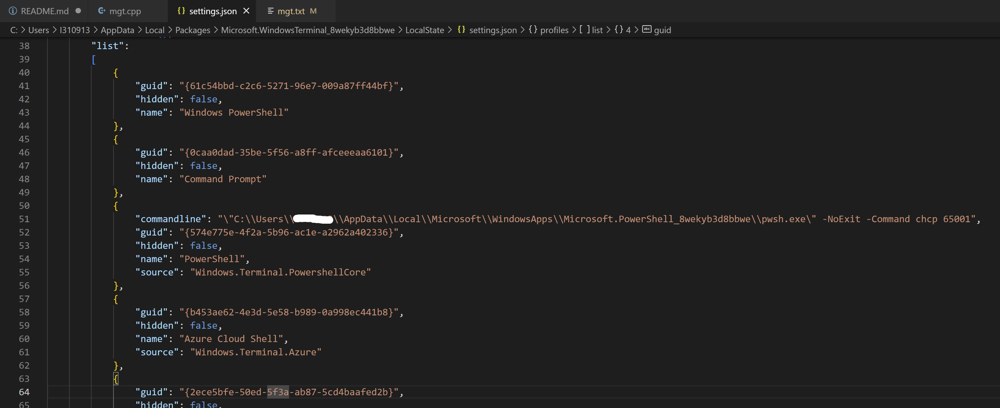

# 个人收支管理系统详细设计

## 1. 课程设计目的和要求

本课程设计旨在通过使用 C++ 编程语言来设计和实现一个个人收支管理系统。主要目的和要求如下：

1. 巩固和加深对 C++ 语言课程的基本知识的理解和掌握。
2. 掌握 C++ 语言编程和程序调试的基本技能。
3. 利用 C++ 语言进行基本的软件设计。
4. 掌握书写程序设计说明文档的能力。
5. 提高运用 C++ 语言解决实际问题的能力。

## 2. 课程设计任务内容

本课程设计的任务是设计和实现一个个人收支管理系统，包括以下主要功能：

- 收入功能：添加收入信息，包括顺序号、日期、摘要、金额、余额和币种。
- 支出功能：添加支出信息，包括顺序号、日期、摘要、金额、余额和币种。
- 明细表：显示收支明细，包括顺序号、日期、摘要、金额、余额、币种和类型（收入或支出）。
- 查询与统计（按月）：按指定月份统计总收入和总支出。
- 查询与统计（按年）：按指定年份统计总收入和总支出。
- 写入文件：将查询与统计结果和当前数据（明细表）写入文件。
- 读取文件：从文件中读取已写入的数据并加载到内存中。

## 3. 详细设计说明

### 3.1 结构体定义

在代码中定义了一个名为 `Transaction` 的结构体类型，用于存储收支信息。结构体包含以下成员：

- `sequenceNumber`：顺序号，表示收支记录的编号。
- `date`：日期，表示收支记录的日期。
- `description`：摘要，表示收支记录的描述。
- `amount`：金额，表示收支记录的金额。
- `balance`：余额，表示收支记录的余额。
- `currency`：币种，表示收支记录的货币类型。
- `isIncome`：收入或支出标志，表示收支记录是收入还是支出。

### 3.2 主函数设计

主函数包含一个主循环，显示主操作界面，并根据用户的选择调用相应的功能函数。

### 3.3 功能函数设计

根据需求分析中的功能要求，设计了以下功能函数：

- `addIncome()`：用于添加收入信息。
- `addExpense()`：用于添加支出信息。
- `showTransactionDetails()`：用于显示收支明细表。
- `showMonthlySummary()`：用于按月查询与统计收支信息。
- `showYearlySummary()`：用于按年查询与统计收支信息。
- `writeToFile()`：用于将数据写入文件。
- `readFromFile()`：用于从文件中读取数据。

#### 3.3.1 结构体 `Transaction`

结构体 `Transaction` 的代码用于表示个人收支信息的数据结构。它包含以下成员：

- `sequenceNumber`（顺序号）：用于标识每条收支记录的唯一编号。
- `date`（日期）：记录收支发生的日期。
- `description`（摘要）：描述收支的简要信息。
- `amount`（金额）：记录收支的具体金额。
- `balance`（余额）：表示该条记录之前的余额。
- `currency`（币种）：表示收支的货币类型。
- `isIncome`（收入或支出标志）：标识该记录是收入还是支出。

该结构体的目的是存储个人收支记录的相关信息，以便后续进行各种操作，如添加、显示、查询和统计。通过使用这个结构体，可以方便地组织和管理个人收支数据。

例如，当用户输入收入信息时，可以创建一个 `Transaction` 结构体对象，并将输入的数据存储在相应的成员变量中。类似地，当用户查询和统计收支信息时，可以使用 `Transaction` 结构体的对象进行操作和计算。

通过结构体 `Transaction`，我们可以将个人收支管理系统的各个功能模块之间的数据进行传递和共享，实现对收支数据的有效管理和处理。

#### 3.3.2 入口函数 `int main()`

`int main()` 是入口函数，它是程序执行的起点。以下是对 `int main()` 函数的代码说明：

1. 创建必要的变量和对象：
   - `vector<Transaction> transactions`：用于存储个人收支信息的容器，即收支记录的集合。这里使用了 `vector` 容器，可以方便地进行动态添加和管理。
   - `int choice`：用于存储用户的选择，即操作选项。

2. 显示主操作界面：
   - 打印欢迎信息和主菜单选项。
   - 提示用户输入操作选项。

3. 根据用户的选择执行相应的操作：
   - 使用 `switch` 语句根据用户输入的选择进行判断和分支。
   - 每个分支对应一个操作选项，通过调用相应的功能函数实现相应的操作。

4. 功能函数的调用和处理：
   - `addIncome()`：当用户选择添加收入信息时，调用该函数来添加收入记录。
   - `addExpense()`：当用户选择添加支出信息时，调用该函数来添加支出记录。
   - `showTransactionDetails()`：当用户选择显示收支明细表时，调用该函数来展示所有收支记录的详细信息。
   - `showMonthlySummary()`：当用户选择按月查询与统计收支信息时，调用该函数来计算并显示指定月份的总收入和总支出。
   - `showYearlySummary()`：当用户选择按年查询与统计收支信息时，调用该函数来计算并显示指定年份的总收入和总支出。
   - `writeToFile()`：当用户选择将数据写入文件时，调用该函数将查询与统计结果和当前数据（明细表）写入文件。
   - `readFromFile()`：当用户选择从文件中读取数据时，调用该函数从文件中读取已写入的数据并加载到内存中。

5. 返回程序执行结果：
   - 当用户选择退出程序时，程序执行到 `case 0` 分支，使用 `return 0` 语句结束程序的执行，并将 `0` 返回给操作系统，表示程序正常结束。

`int main()` 函数负责驱动整个程序的执行流程，根据用户的选择调用相应的功能函数，实现个人收支管理系统的各项操作和功能。它起到了整合和协调其他功能函数的作用，使程序能够根据用户需求进行相应的处理，并根据操作选项进行相应的流程控制。

#### 3.3.3 函数`showMainMenu()`

`void showMainMenu()` 函数的代码用于显示主操作界面的菜单选项。以下是 `void showMainMenu()` 函数的代码说明：

1. 打印欢迎信息：
   - 使用 `cout` 输出欢迎信息，向用户展示个人收支管理系统的功能和用途。

2. 打印主菜单选项：
   - 使用 `cout` 依次输出主菜单的各个选项和对应的功能说明。

3. 提示用户输入操作选项：
   - 使用 `cout` 输出提示信息，要求用户输入操作选项。

4. 结束函数执行：
   - 使用 `return` 语句结束函数的执行。由于该函数的返回类型为 `void`，因此没有返回具体的值。

通过 `void showMainMenu()` 函数，用户可以在程序运行时看到一个友好的主操作界面，展示了系统的功能选项，并通过提示信息获取用户的选择。该函数将主菜单选项打印到标准输出流上，并等待用户输入操作选项。它提供了程序与用户之间的交互界面，使用户能够选择所需的操作，并进一步驱动程序的执行。

#### 3.3.4 函数 `addIncome()`

`void addIncome(vector<Transaction> &transactions)` 函数的代码用于添加收入信息到个人收支管理系统中。以下是代码说明：

1. 创建临时的 `Transaction` 结构体对象 `income`：
   - 使用默认的构造函数创建一个名为 `income` 的 `Transaction` 结构体对象，用于存储用户输入的收入信息。

2. 提示用户输入收入信息：
   - 使用 `cout` 输出提示信息，要求用户依次输入收入的相关信息，包括顺序号、日期、摘要、金额、余额、币种等。

3. 获取用户输入的收入信息：
   - 使用 `cin` 依次接收用户输入的收入信息，并将其存储到 `income` 对象的相应成员变量中。

4. 设置收入标志：
   - 将 `income` 对象的 `isIncome` 成员变量设置为 `true`，表示这是一条收入记录。

5. 将收入信息添加到收支记录容器中：
   - 使用 `push_back()` 函数将 `income` 对象添加到 `transactions` 容器中，实现将收入信息存储到个人收支管理系统中。

其中，`vector<Transaction> &transactions` 是函数参数的一部分，表示一个引用类型的向量（`vector`），其中存储了 `Transaction` 结构体类型的数据。

- `vector<Transaction>`：表示一个向量（数组）容器，用于存储 `Transaction` 结构体类型的数据。`Transaction` 结构体定义了个人收支信息的数据结构。
- `&transactions`：表示对向量 `transactions` 的引用。通过引用传递，可以避免在函数调用时创建副本，节省内存和提高性能。

通过将 `vector<Transaction> &transactions` 作为函数参数，函数可以直接访问和修改调用函数时传递给它的 `transactions` 向量对象。这样，在函数内部对 `transactions` 进行的任何修改都会影响到原始的向量对象。这种传递方式通常用于传递大型数据结构，以避免复制整个对象，从而提高程序的效率。

在函数调用时，可以将一个已经存在的向量对象作为参数传递给 `vector<Transaction> &transactions`。函数将直接使用传递的向量对象进行操作，而不会创建新的副本。这使得函数能够修改原始向量对象的内容，而不仅仅是操作传递过来的副本。

通过 `void addIncome(vector<Transaction> &transactions)` 函数，用户可以输入收入信息，并将其添加到个人收支管理系统中。该函数通过创建临时的 `Transaction` 对象，获取用户输入的收入信息，并将其添加到收支记录容器中。这样，个人收支管理系统就能够动态地记录和管理用户的收入信息，方便后续的查询、统计和展示。

#### 3.3.5 函数 `addExpense()`

`void addExpense(vector<Transaction> &transactions)` 函数的代码用于添加支出信息到个人收支管理系统中。以下是代码说明：

1. 创建临时的 `Transaction` 结构体对象 `expense`：
   - 使用默认的构造函数创建一个名为 `expense` 的 `Transaction` 结构体对象，用于存储用户输入的支出信息。

2. 提示用户输入支出信息：
   - 使用 `cout` 输出提示信息，要求用户依次输入支出的相关信息，包括顺序号、日期、摘要、金额、余额、币种等。

3. 获取用户输入的支出信息：
   - 使用 `cin` 依次接收用户输入的支出信息，并将其存储到 `expense` 对象的相应成员变量中。

4. 设置支出标志：
   - 将 `expense` 对象的 `isIncome` 成员变量设置为 `false`，表示这是一条支出记录。

5. 将支出信息添加到收支记录容器中：
   - 使用 `push_back()` 函数将 `expense` 对象添加到 `transactions` 容器中，实现将支出信息存储到个人收支管理系统中。

通过 `void addExpense(vector<Transaction> &transactions)` 函数，用户可以输入支出信息，并将其添加到个人收支管理系统中。该函数通过创建临时的 `Transaction` 对象，获取用户输入的支出信息，并将其添加到收支记录容器中。这样，个人收支管理系统就能够动态地记录和管理用户的支出信息，方便后续的查询、统计和展示。同时，通过传入引用类型的向量参数 `transactions`，可以直接对原始向量对象进行修改，而不需要进行数据的复制和传递，提高了程序的效率。

#### 3.3.6 函数 `showTransactionDetails()`

`void showTransactionDetails(const vector<Transaction> &transactions)` 函数的代码用于显示个人收支管理系统中的收支明细信息。以下是代码说明：

1. 检查收支记录是否为空：
   - 使用 `empty()` 函数检查传入的 `transactions` 向量是否为空，即是否没有任何收支记录。

2. 打印表头信息：
   - 使用 `cout` 输出收支明细表的表头信息，包括各列的标题，如顺序号、日期、摘要、金额、余额、币种等。

3. 遍历收支记录：
   - 使用 `for` 循环遍历 `transactions` 向量中的每个 `Transaction` 结构体对象。

4. 打印每条收支记录的详细信息：
   - 对于每个 `Transaction` 结构体对象，使用成员访问运算符 `.` 来访问其各个成员变量，如顺序号、日期、摘要、金额、余额、币种等。
   - 使用 `cout` 将每个成员变量的值输出到标准输出流上，以显示收支记录的详细信息。

通过 `void showTransactionDetails(const vector<Transaction> &transactions)` 函数，用户可以查看个人收支管理系统中的收支明细信息。该函数通过遍历收支记录向量，并输出每条收支记录的详细信息，以表格形式展示在终端上。如果收支记录为空，将显示相应的提示信息。这样，用户可以方便地了解个人的收入和支出情况，并进行进一步的数据分析和统计。同时，通过传入常量引用类型的向量参数 `transactions`，可以避免对原始数据的修改，确保函数的安全性和数据的一致性。

#### 3.3.7 函数 `showMonthlySummary()`

`void showMonthlySummary(const vector<Transaction> &transactions)` 函数的代码用于按月份统计个人收支管理系统中的总收入和总支出。以下是代码说明：

1. 创建一个 `map<string, double>` 对象 `monthlySummary`：
   - `monthlySummary` 是一个关联容器，用于存储按月份统计的总收入和总支出。其中，`string` 类型表示月份，`double` 类型表示对应月份的总金额。

2. 遍历收支记录：
   - 使用 `for` 循环遍历 `transactions` 向量中的每个 `Transaction` 结构体对象。

3. 计算每月的总收入和总支出：
   - 对于每个 `Transaction` 结构体对象，使用成员访问运算符 `.` 来访问其各个成员变量，如月份、金额和收入标志。
   - 根据月份和收入标志，将对应的金额累加到 `monthlySummary` 中相应月份的总金额上。

4. 打印月度统计信息：
   - 使用 `cout` 输出月度统计信息的表头，包括月份、总收入和总支出的标题。
   - 使用 `for` 循环遍历 `monthlySummary` 中的每个月份，并使用成员访问运算符 `.` 访问月份和总金额。
   - 使用 `cout` 将每个月份和对应的总收入、总支出输出到标准输出流上，以显示月度统计信息。

通过 `void showMonthlySummary(const vector<Transaction> &transactions)` 函数，用户可以查看个人收支管理系统按月份统计的总收入和总支出信息。该函数根据收支记录的月份和收入标志，将相应的金额累加到月度统计信息中，并将统计结果以表格形式展示在终端上。这样，用户可以方便地了解每个月份的总收入和总支出情况，进一步分析和比较不同月份之间的收支情况。通过传入常量引用类型的向量参数 `transactions`，函数可以安全地访问收支记录数据，同时保持数据的一致性和不变性。

#### 3.3.8 函数 `showYearlySummary()`

`void showYearlySummary(const vector<Transaction> &transactions)` 函数的代码用于按年份统计个人收支管理系统中的总收入和总支出。以下是代码说明：

1. 创建一个 `map<string, double>` 对象 `yearlySummary`：
   - `yearlySummary` 是一个关联容器，用于存储按年份统计的总收入和总支出。其中，`string` 类型表示年份，`double` 类型表示对应年份的总金额。

2. 遍历收支记录：
   - 使用 `for` 循环遍历 `transactions` 向量中的每个 `Transaction` 结构体对象。

3. 计算每年的总收入和总支出：
   - 对于每个 `Transaction` 结构体对象，使用成员访问运算符 `.` 来访问其各个成员变量，如年份、金额和收入标志。
   - 根据年份和收入标志，将对应的金额累加到 `yearlySummary` 中相应年份的总金额上。

4. 打印年度统计信息：
   - 使用 `cout` 输出年度统计信息的表头，包括年份、总收入和总支出的标题。
   - 使用 `for` 循环遍历 `yearlySummary` 中的每个年份，并使用成员访问运算符 `.` 访问年份和总金额。
   - 使用 `cout` 将每个年份和对应的总收入、总支出输出到标准输出流上，以显示年度统计信息。

通过 `void showYearlySummary(const vector<Transaction> &transactions)` 函数，用户可以查看个人收支管理系统按年份统计的总收入和总支出信息。该函数根据收支记录的年份和收入标志，将相应的金额累加到年度统计信息中，并将统计结果以表格形式展示在终端上。这样，用户可以方便地了解每个年份的总收入和总支出情况，进一步分析和比较不同年份之间的收支情况。通过传入常量引用类型的向量参数 `transactions`，函数可以安全地访问收支记录数据，同时保持数据的一致性和不变性。

#### 3.3.9 函数 `writeToFile()`

`void writeToFile(const vector<Transaction> &transactions)` 函数的代码用于将个人收支管理系统中的收支记录写入文件。以下是代码说明：

1. 创建输出文件流对象：
   - 使用 `ofstream` 类创建一个输出文件流对象 `outfile`，用于将数据写入文件。

2. 打开文件：
   - 使用 `open()` 函数打开文件，参数为文件名和打开模式。在这里，打开模式为 `ios::out`，表示以写入方式打开文件。

3. 检查文件是否成功打开：
   - 使用 `is_open()` 函数检查文件是否成功打开。如果文件未成功打开，则输出错误信息并返回。

4. 遍历收支记录：
   - 使用 `for` 循环遍历 `transactions` 向量中的每个 `Transaction` 结构体对象。

5. 将收支记录写入文件：
   - 对于每个 `Transaction` 结构体对象，使用成员访问运算符 `.` 来访问其各个成员变量，如顺序号、日期、摘要、金额、余额、币种等。
   - 使用输出文件流对象 `outfile`，结合插入运算符 `<<`，将每个成员变量的值写入文件中，以保存收支记录的详细信息。

6. 关闭文件：
   - 使用 `close()` 函数关闭文件，以确保文件操作的完成和资源的释放。

通过 `void writeToFile(const vector<Transaction> &transactions)` 函数，用户可以将个人收支管理系统中的收支记录写入文件，以便后续的数据保存和使用。该函数通过遍历收支记录向量，并将每条收支记录的详细信息写入文件中，实现数据的持久化存储。通过传入常量引用类型的向量参数 `transactions`，函数可以安全地访问收支记录数据，同时保持数据的一致性和不变性。

#### 3.3.10 函数 `readFromFile()`

`void readFromFile(vector<Transaction> &transactions)` 函数的代码用于从文件中读取收支记录并加载到个人收支管理系统中。以下是代码说明：

1. 创建输入文件流对象：
   - 使用 `ifstream` 类创建一个输入文件流对象 `infile`，用于从文件中读取数据。

2. 打开文件：
   - 使用 `open()` 函数打开文件，参数为文件名和打开模式。在这里，打开模式为 `ios::in`，表示以读取方式打开文件。

3. 检查文件是否成功打开：
   - 使用 `is_open()` 函数检查文件是否成功打开。如果文件未成功打开，则输出错误信息并返回。

4. 清空现有的收支记录：
   - 使用 `clear()` 函数清空向量 `transactions` 中的现有收支记录，以便加载新的记录。

5. 读取文件内容：
   - 使用 `while` 循环结合输入文件流对象 `infile` 的提取运算符 `>>`，连续读取文件中的每条收支记录的各个字段值。
   - 对于每个字段，使用成员访问运算符 `.` 来访问 `Transaction` 结构体对象的对应成员变量，如顺序号、日期、摘要、金额、余额、币种等。
   - 将读取的字段值赋值给对应的成员变量，以加载收支记录的详细信息。

6. 关闭文件：
   - 使用 `close()` 函数关闭文件，以确保文件操作的完成和资源的释放。

通过 `void readFromFile(vector<Transaction> &transactions)` 函数，用户可以从文件中读取收支记录，并加载到个人收支管理系统中，以恢复之前保存的数据。该函数通过打开文件、逐行读取文件内容，并将各个字段的值赋给 `Transaction` 结构体对象的成员变量，实现数据的加载和恢复。通过传入引用类型的向量参数 `transactions`，函数可以直接修改收支记录数据，以反映从文件中读取的最新数据。

### 3.4 输入和输出设计

程序通过标准输入和输出流与用户进行交互。用户可以在命令行界面输入指定的操作选项和参数，程序会根据输入的内容进行相应的处理，并将结果输出到标准输出流中。

## 4. 软件使用说明

### 4.1 编译和执行

要编译和执行程序，按照以下步骤操作：

4.1.1. 确保已经安装了合适的 C++ 编译器（如 g++）并配置了开发环境。

4.1.2. 将代码保存到一个名为 `mgt.cpp` 的文件中。

4.1.3. 使用命令行界面进入保存 `mgt.cpp` 文件的目录。

4.1.4. 运行以下命令进行编译：

```bash
g++ -std=c++11 -fexec-charset=utf-8 mgt.cpp -o mgt.exe
```

这将生成一个名为 `mgt.exe` 的可执行文件。

4.1.5. 配置Windows Terminal：

因为代码中有中文输出，所以需要在Windows Terminal中配置UTF-8字符集，来支持中文显示。

两种方式，一种是直接在Windows Terminal上修改配置，一种是修改Windows Terminal的JSON文件。

方法1：修改Windows Terminal的设置



方法2：修改Windows Terminal的JSON文件



4.1.6. 运行以下命令来执行程序：

- 在 Windows 上：

```bash
mgt.exe
```

- 在 macOS 或 Linux 上：

```bash
./mgt.exe
```

程序执行时会首先要求读入外部保存文件，这里是mgt.txt文件，此程序使用此文件保存收支记录。

### 4.2 操作指南

在程序运行后，会显示主操作界面，根据提示进行相应的操作：

- 输入 `1`：添加收入信息。
- 输入 `2`：添加支出信息。
- 输入 `3`：显示收支明细表。
- 输入 `4`：按月查询与统计收支信息。
- 输入 `5`：按年查询与统计收支信息。
- 输入 `6`：将数据写入文件。
- 输入 `7`：从文件中读取数据。
- 输入 `0`：退出程序。

根据需要选择相应的操作选项，并按照提示输入参数。

## 5. 课程设计总结

通过完成本课程设计，学生能够巩固和加深对 C++ 语言的理解和掌握，掌握 C++ 语言编程和程序调试的基本技能，并通过实际设计和开发一个个人收支管理系统来提高运用 C++ 语言解决实际问题的能力。在设计过程中，学生需要进行需求分析、设计功能模块、定义合适的数据结构等步骤，同时还需要编写课程设计报告和整理源代码。

## 6. 附录

### 6.1 参考文献

- [C++ Reference](https://en.cppreference.com/)

### 6.2 程序清单

- `mgt.cpp`：包含完整的程序代码，实现了个人收支管理系统的各项功能。
